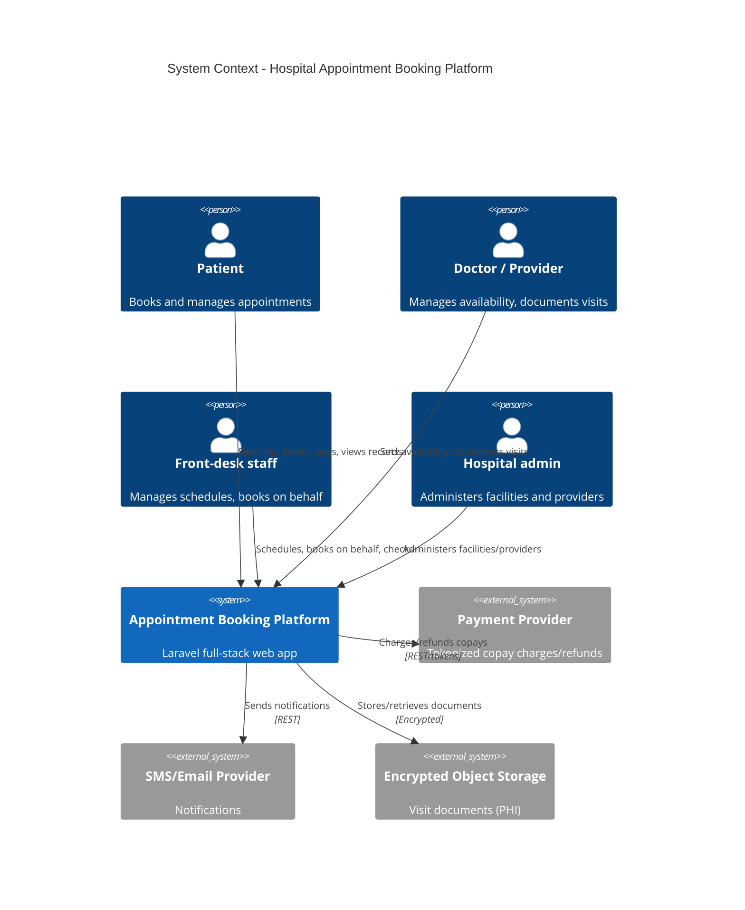

# Hospital Appointment Booking Platform - System Context

## System Overview

A full-stack web platform for a multi-hospital network. Patients discover providers and
self-book fixed time-slot appointments; providers manage availability; front-desk staff
manage schedules and book on patients' behalf; admins administer facilities, departments,
providers, and settings. The platform collects copays at booking, sends notifications, and
attaches visit documentation to appointments. It operates under HIPAA.

## Actors

| Actor | Type | Interface | Description |
|-------|------|-----------|-------------|
| Patient | Human | Web UI | Searches providers, books/reschedules/cancels appointments, views own records, pays copays |
| Doctor / Provider | Human | Web UI | Publishes availability, documents visits, views their schedule |
| Front-desk staff | Human | Web UI | Manages schedules, books on behalf of patients, handles walk-ins, check-in |
| Hospital admin | Human | Web UI | Manages facilities, departments, providers, staff, and settings |
| Notification dispatcher | System | Scheduler/Queue | Sends reminders on a schedule and reacts to appointment events |

## External Integrations

- **Payment provider** (outbound, REST, BAA required): tokenized copay charges and refunds; no PAN stored locally.
- **SMS/Email provider** (outbound, REST, BAA required): booking confirmations, reminders, cancellation/reschedule notices.
- **Object storage** (outbound, encrypted): storage for uploaded visit documents (PHI), encrypted at rest.
- **Identity/MFA** (internal + TOTP/SMS factor): authentication and MFA for provider/staff/admin roles.

## Context Diagram

## Data Flows

### Inbound
- Patient/staff booking requests (slot selection, visit reason, intake fields) — JSON, validated for slot availability and required fields.
- Provider availability definitions (working hours, slot length, time-off) — JSON.
- Admin facility/department/provider/staff management — JSON.
- Payment provider webhooks (charge/refund status) — JSON, signature-verified.
- Uploaded visit documents — binary, virus/size-validated, stored encrypted.

### Outbound
- Tokenized payment charge/refund requests to the payment provider.
- Notification dispatch (email/SMS) with minimum-necessary PHI.
- Confirmation references and appointment details to patients/staff.

## High-Level Constraints

- Runs on Laravel 13 / Sail, MySQL 8.4 (see CLAUDE.md and `memory-bank/standards/`).
- Slot booking must be transactionally safe under concurrency (DB-level locking/unique constraints).
- PHI encrypted in transit (TLS 1.2+) and at rest (AES-256); immutable audit log of PHI access.
- Third-party payment and messaging vendors must operate under a BAA.

## Key NFR Goals

- Search < 500ms p95, booking confirmation < 1s p95.
- ~50 facilities, 50,000+ accounts, 5,000 concurrent peak, 20,000+ bookings/day.
- 99.9% uptime, RTO < 1h, RPO < 15m.
- HIPAA compliance; WCAG 2.1 AA for patient-facing flows.
